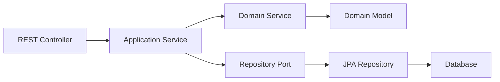

# Hexagonal Architecture

## Overview

This template implements **Hexagonal Architecture** (also known as Ports and Adapters), which provides a clean separation between business logic and external concerns.

## Architecture Layers

### 🎯 Domain Layer (`domain/`)
**Purpose**: Contains the core business logic and domain models.

**Characteristics**:
- No external dependencies
- Pure business logic
- Domain models and entities
- Business rules and validations
- Domain exceptions

**Components**:
```
domain/
├── model/           # Domain entities and value objects
├── ports/
│   ├── input/      # Use case interfaces (inbound ports)
│   └── output/     # Repository interfaces (outbound ports)
└── exception/      # Domain-specific exceptions
```

### 🔧 Application Layer (`application/`)
**Purpose**: Orchestrates domain objects and coordinates application flow.

**Characteristics**:
- Depends only on domain layer
- Implements use cases
- Coordinates between domain and infrastructure
- Contains DTOs for data transfer

**Components**:
```
application/
├── dto/            # Data Transfer Objects
├── mapper/         # MapStruct mappers
└── service/        # Application services (use case implementations)
```

### 🏗️ Infrastructure Layer (`infrastructure/`)
**Purpose**: Implements technical details and external integrations.

**Characteristics**:
- Depends on application and domain layers
- Implements ports defined in domain layer
- Handles external concerns (database, web, etc.)
- Contains framework-specific code

**Components**:
```
infrastructure/
├── adapters/
│   ├── input/
│   │   └── rest/   # REST controllers
│   └── output/
│       └── persistence/  # JPA repositories and entities
├── config/         # Spring configuration
└── exceptions/     # Global exception handling
```

## Benefits

### 🔄 Testability
- Easy to unit test business logic
- Mock external dependencies
- Test each layer independently

### 🔧 Maintainability
- Clear separation of concerns
- Easy to modify without affecting other layers
- Follows SOLID principles

### 🔌 Flexibility
- Easy to swap implementations
- Framework-independent business logic
- Support for multiple adapters

### 📈 Scalability
- Modular design
- Easy to extend functionality
- Clear boundaries between components

## Data Flow



1. **Request** comes through REST controller (input adapter)
2. **Controller** calls application service
3. **Application service** orchestrates domain objects
4. **Domain objects** contain business logic
5. **Repository port** defines data access contract
6. **JPA repository** implements the port (output adapter)
7. **Database** persists the data

## Implementation Guidelines

### Domain Layer Rules
- ❌ No Spring annotations
- ❌ No JPA annotations
- ❌ No external dependencies
- ✅ Pure Java objects
- ✅ Business logic only

### Application Layer Rules
- ✅ Can use Spring annotations for services
- ✅ Implements domain ports
- ✅ Coordinates between layers
- ❌ No direct database access

### Infrastructure Layer Rules
- ✅ Spring Boot configurations
- ✅ JPA entities and repositories
- ✅ REST controllers
- ✅ External service clients
- ✅ Framework-specific code