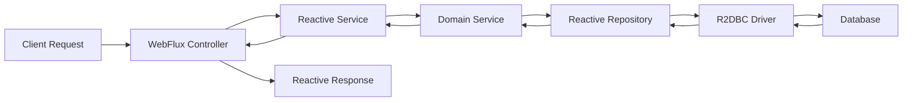

# Reactive Hexagonal Architecture

## Overview

This template combines **Hexagonal Architecture** with **Reactive Programming** principles, creating a non-blocking, high-performance microservice architecture.

## Reactive Architecture Layers

### 🎯 Reactive Domain Layer (`domain/`)
**Purpose**: Contains reactive business logic and domain models.

**Characteristics**:
- Reactive business operations returning `Mono` and `Flux`
- Domain models optimized for reactive processing
- Non-blocking business rules and validations
- Reactive domain events

**Components**:
```
domain/
├── model/           # Domain entities (reactive-friendly)
├── ports/
│   ├── input/      # Reactive use case interfaces
│   └── output/     # Reactive repository interfaces
└── exception/      # Domain exceptions for reactive flows
```

**Example Reactive Port**:
```java
public interface UserService {
    Mono<User> createUser(User user);
    Flux<User> findAllUsers();
    Mono<User> findUserById(String id);
    Mono<Void> deleteUser(String id);
}
```

### 🔧 Reactive Application Layer (`application/`)
**Purpose**: Orchestrates reactive domain objects and coordinates reactive flows.

**Characteristics**:
- Implements reactive use cases
- Handles reactive data transformation
- Manages reactive error handling
- Coordinates between reactive components

**Components**:
```
application/
├── dto/            # DTOs for reactive endpoints
├── mapper/         # MapStruct mappers for reactive types
└── service/        # Reactive application services
```

**Example Reactive Service**:
```java
@Service
public class UserApplicationService implements UserService {
    
    public Mono<UserDto> createUser(CreateUserRequest request) {
        return userMapper.toEntity(request)
            .flatMap(userRepository::save)
            .map(userMapper::toDto)
            .doOnSuccess(user -> log.info("User created: {}", user.getId()));
    }
}
```

### 🏗️ Reactive Infrastructure Layer (`infrastructure/`)
**Purpose**: Implements reactive technical details and external integrations.

**Characteristics**:
- WebFlux controllers with reactive endpoints
- R2DBC repositories for reactive database access
- Reactive configurations and middleware
- Non-blocking external service clients

**Components**:
```
infrastructure/
├── adapters/
│   ├── input/
│   │   └── rest/   # WebFlux controllers
│   └── output/
│       └── persistence/  # R2DBC repositories
├── config/         # Reactive Spring configuration
└── exceptions/     # Reactive global exception handling
```

**Example Reactive Controller**:
```java
@RestController
@RequestMapping("/api/users")
public class UserController {
    
    @PostMapping
    public Mono<UserDto> createUser(@RequestBody CreateUserRequest request) {
        return userService.createUser(request);
    }
    
    @GetMapping
    public Flux<UserDto> getAllUsers() {
        return userService.findAllUsers();
    }
}
```

## Reactive Data Flow



## Reactive Patterns

### 🔄 Publisher Types

**Mono<T>**: Represents 0 or 1 element
```java
Mono<User> findUserById(String id);
Mono<Void> deleteUser(String id);
```

**Flux<T>**: Represents 0 to N elements
```java
Flux<User> findAllUsers();
Flux<User> findUsersByStatus(Status status);
```

### ⚡ Reactive Operations

**Transformation**:
```java
userRepository.findById(id)
    .map(userMapper::toDto)
    .switchIfEmpty(Mono.error(new UserNotFoundException(id)));
```

**Composition**:
```java
userRepository.findById(id)
    .flatMap(user -> auditService.logAccess(user.getId())
        .then(Mono.just(user)))
    .map(userMapper::toDto);
```

**Error Handling**:
```java
userService.createUser(request)
    .onErrorMap(DataIntegrityViolationException.class, 
        ex -> new UserAlreadyExistsException(request.getEmail()))
    .doOnError(ex -> log.error("Failed to create user", ex));
```

### 🌊 Backpressure Handling

**Buffering**:
```java
userRepository.findAll()
    .buffer(100)  // Process in batches of 100
    .flatMap(this::processBatch);
```

**Rate Limiting**:
```java
userRepository.findAll()
    .delayElements(Duration.ofMillis(10))  // Throttle processing
    .take(1000);  // Limit total elements
```

## Reactive Database Integration

### R2DBC Configuration
```java
@Configuration
public class R2dbcConfig {
    
    @Bean
    public ConnectionFactory connectionFactory() {
        return ConnectionFactories.get(
            "r2dbc:postgresql://localhost:5432/userdb"
        );
    }
}
```

### Reactive Repository
```java
@Repository
public interface UserRepository extends ReactiveCrudRepository<User, String> {
    
    Flux<User> findByStatus(Status status);
    
    @Query("SELECT * FROM users WHERE email = :email")
    Mono<User> findByEmail(String email);
    
    @Modifying
    @Query("UPDATE users SET last_login = :lastLogin WHERE id = :id")
    Mono<Void> updateLastLogin(String id, LocalDateTime lastLogin);
}
```

## Reactive Testing

### WebTestClient
```java
@SpringBootTest(webEnvironment = SpringBootTest.WebEnvironment.RANDOM_PORT)
class UserControllerTest {
    
    @Autowired
    private WebTestClient webTestClient;
    
    @Test
    void shouldCreateUser() {
        CreateUserRequest request = new CreateUserRequest("john@example.com");
        
        webTestClient.post()
            .uri("/api/users")
            .bodyValue(request)
            .exchange()
            .expectStatus().isCreated()
            .expectBody(UserDto.class)
            .value(user -> assertThat(user.getEmail()).isEqualTo("john@example.com"));
    }
}
```

### StepVerifier
```java
@Test
void shouldFindAllUsers() {
    Flux<User> users = userRepository.findAll();
    
    StepVerifier.create(users)
        .expectNextCount(3)
        .verifyComplete();
}
```

## Performance Considerations

### Thread Model
- **Event Loop**: Few threads handle all requests
- **Non-blocking**: No thread blocking on I/O operations
- **Scheduler**: Control execution context with `subscribeOn()` and `publishOn()`

### Memory Management
- **Lazy Evaluation**: Operations are not executed until subscription
- **Streaming**: Process data as it arrives, not all at once
- **Garbage Collection**: Reduced pressure due to fewer objects

### Monitoring
- **Reactive Metrics**: Monitor backpressure, subscription rates
- **Custom Metrics**: Track reactive operation performance
- **Health Checks**: Reactive health indicators