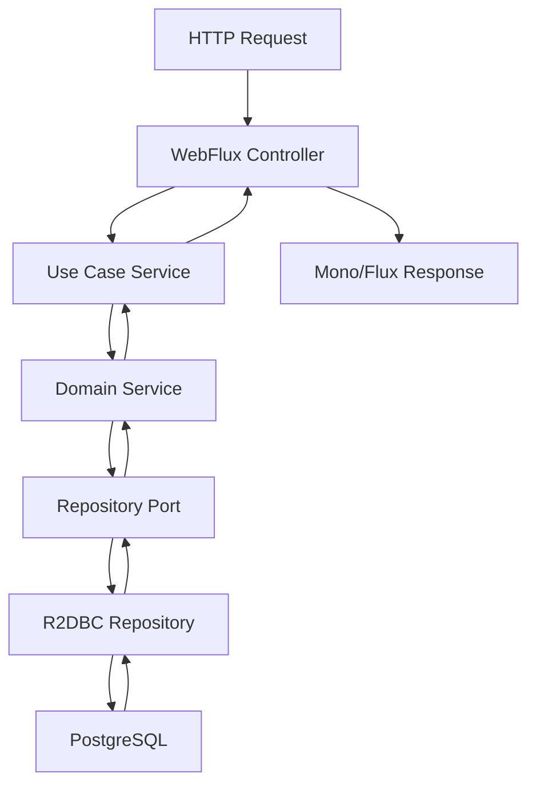

# Architecture

## Hexagonal Architecture (Ports and Adapters)

This template generates projects following the **Hexagonal Architecture** pattern with reactive programming.

### Generated Project Structure

```
src/main/java/com/example/service/
├── application/              # Application Layer
│   ├── dto/                 # Data Transfer Objects
│   ├── mapper/              # MapStruct mappers
│   └── service/             # Use case implementations
├── domain/                  # Domain Layer
│   ├── model/               # Domain entities
│   └── ports/               # Port interfaces
│       ├── input/           # Input ports (use cases)
│       └── output/          # Output ports (repositories)
└── infrastructure/          # Infrastructure Layer
    ├── adapters/
    │   ├── input/rest/      # REST controllers
    │   └── output/persistence/ # R2DBC repositories
    └── config/              # Configuration classes
```

### Reactive Flow

The generated microservice follows this reactive flow:



### Key Benefits

- **Non-blocking**: Better resource utilization
- **Scalable**: Handles more concurrent requests
- **Testable**: Clean separation of concerns
- **Maintainable**: Clear architectural boundaries
- **Flexible**: Easy to change external dependencies
