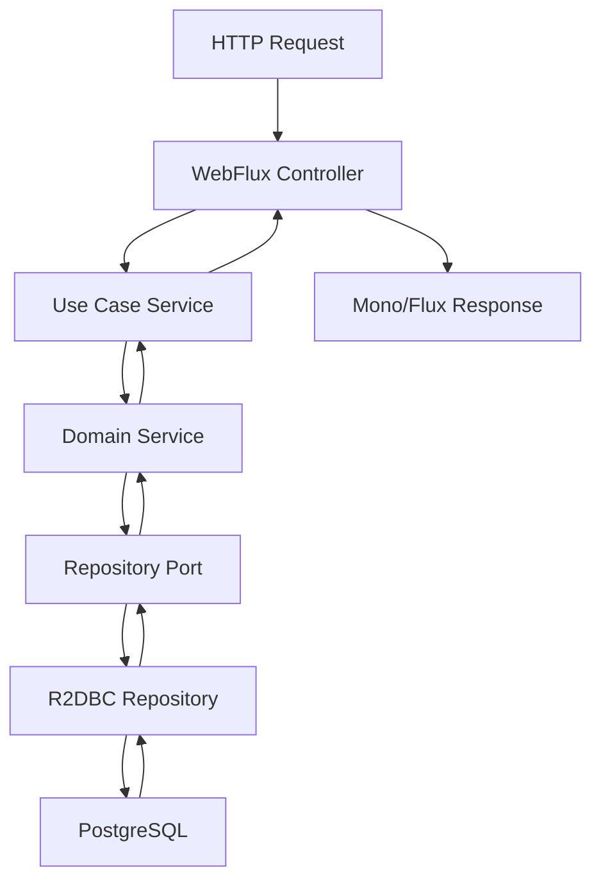

# Arquitectura

## Arquitectura Hexagonal (Puertos y Adaptadores)

Esta plantilla genera proyectos siguiendo el patrón de **Arquitectura Hexagonal** con programación reactiva.

### Estructura del Proyecto Generado

```
src/main/java/com/example/service/
├── application/              # Capa de Aplicación
│   ├── dto/                 # Objetos de Transferencia de Datos
│   ├── mapper/              # Mapeadores MapStruct
│   └── service/             # Implementaciones de casos de uso
├── domain/                  # Capa de Dominio
│   ├── model/               # Entidades de dominio
│   └── ports/               # Interfaces de puertos
│       ├── input/           # Puertos de entrada (casos de uso)
│       └── output/          # Puertos de salida (repositorios)
└── infrastructure/          # Capa de Infraestructura
    ├── adapters/
    │   ├── input/rest/      # Controladores REST
    │   └── output/persistence/ # Repositorios R2DBC
    └── config/              # Clases de configuración
```

### Flujo Reactivo

El microservicio generado sigue este flujo reactivo:



### Beneficios Clave

- **No bloqueante**: Mejor utilización de recursos
- **Escalable**: Maneja más peticiones concurrentes
- **Testeable**: Separación clara de responsabilidades
- **Mantenible**: Límites arquitectónicos claros
- **Flexible**: Fácil cambiar dependencias externas
